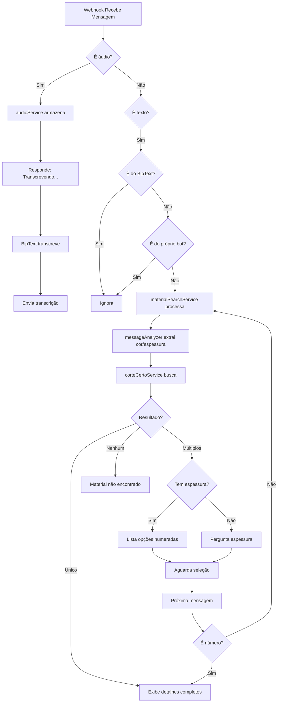

# 🔄 Fluxograma do Sistema

## 📨 Recebimento de Mensagem



## 🎯 Fluxo de Busca Inteligente

### Cenário 1: Busca Completa
```
Usuário: "Branco Liso 18mm"
         ↓
   Análise de Mensagem
         ↓
   Cor: Branco Liso
   Espessura: 18mm
         ↓
   Busca no Banco
         ↓
   1 resultado encontrado
         ↓
   Exibe: Chapas + Retalhos
```

### Cenário 2: Busca Sem Espessura
```
Usuário: "Branco Liso"
         ↓
   Análise de Mensagem
         ↓
   Cor: Branco Liso
   Espessura: null
         ↓
   Busca no Banco
         ↓
   5 espessuras encontradas
   (6, 9, 15, 18, 25mm)
         ↓
   Bot: "Qual espessura?"
         ↓
Usuário: "18"
         ↓
   Busca específica 18mm
         ↓
   Exibe resultado
```

### Cenário 3: Busca Parcial
```
Usuário: "Branco 18mm"
         ↓
   Análise de Mensagem
         ↓
   Cor: Branco
   Espessura: 18mm
         ↓
   Busca no Banco
         ↓
   3 resultados 18mm:
   - Branco Liso
   - Branco Diamante
   - Branco Ártico
         ↓
   Bot: Lista numerada
         ↓
Usuário: "1"
         ↓
   Seleciona Branco Liso
         ↓
   Exibe resultado
```

## 🎤 Fluxo de Transcrição de Áudio

```
Usuário envia áudio
         ↓
   webhookService recebe
         ↓
   {É do BipText?} ----Sim----> [IGNORA]
         ↓ Não
   audioService armazena
         ↓
   messageService.replyToMessage()
   "Transcrevendo áudio..."
         ↓
   POST /audio/transcribe/:sessionId
   {audioBase64, filename}
         ↓
   BipText processa (até 2min)
         ↓
   Retorna transcrição
         ↓
   audioService.markAsTranscribed()
         ↓
   messageService.replyToMessage()
   "Transcrição: [texto]"
```

## 📂 Estrutura de Dados do Corte Certo

### Arquivo INI (M{codigo}.INI)
```ini
[DESC]
CAMPO1=BRANCO LISO 18mm      ← Nome do material
FAMILIA=LISO                 ← Família

[PROP_FISIC]
ESPESSURA=18                 ← Espessura em mm
VEIO_HORIZONTAL=1            ← Veio horizontal ativo
VEIO_VERTICAL=0              ← Veio vertical inativo

[PROP_COMERC]
PRECO_CHAPA=128.00           ← Preço
```

### Arquivo TAB - Chapas (CHP00{codigo}.TAB)
```
Formato: espaço separado
Colunas: ativo numero codigo altura largura descricao

1 1 9992 2740.0 1840.0 __**_9993>9992
↑ ↑  ↑    ↑      ↑      ↑
│ │  │    │      │      └─ Descrição
│ │  │    │      └──────── Largura (mm)
│ │  │    └─────────────── Altura (mm)
│ │  └──────────────────── Código material
│ └─────────────────────── Número sequencial
└───────────────────────── Ativo (1=sim)
```

### Arquivo TAB - Retalhos (RET00{codigo}.TAB)
```
Formato: vírgula separado
Colunas: numero,ativo,quantidade,altura,largura,descricao

1,+,1,706.0,330.0,A2,,
↑ ↑ ↑  ↑     ↑    ↑
│ │ │  │     │    └─ Descrição
│ │ │  │     └────── Largura (mm)
│ │ │  └──────────── Altura (mm)
│ │ └─────────────── Quantidade
│ └───────────────── Ativo (+/-)
└─────────────────── Número
```

## 🧠 Contexto de Conversação

```javascript
// Estrutura do contexto salvo por usuário
{
  "555197756708@c.us": {
    timestamp: 1699123456789,
    awaitingSelection: true,      // Aguarda número
    awaitingThickness: false,     // Aguarda espessura
    materials: [                  // Últimos resultados
      {codigo: "1", nome: "Branco Liso 18mm", ...},
      {codigo: "2", nome: "Branco Diamante 18mm", ...}
    ],
    espessura: 18,
    byThickness: {                // Agrupado por espessura
      "6": [...],
      "18": [...],
      "25": [...]
    }
  }
}

// Expira em 10 minutos
// Limpeza automática a cada 5 minutos
```

## ⚡ Performance

| Operação | Tempo | Cache |
|----------|-------|-------|
| Carregar materiais (267) | ~50ms | 5min |
| Busca por nome | ~5ms | - |
| Ler chapas/retalhos | ~10ms | - |
| Parse INI | ~1ms | - |
| Contexto de conversação | - | 10min |

## 🔒 Filtros de Segurança

```javascript
// Mensagens ignoradas automaticamente:

1. fromMe === true          // Próprias mensagens do bot
2. from === BipTextNumber   // Mensagens do BipText
3. event === 'qr'           // Eventos de QR Code
4. event === 'loading_screen' // Tela de carregamento
5. sessionId não monitorado // Fora do .env
```

---

**Diagrama criado em**: 11/11/2025  
**Linguagem**: Mermaid + Markdown
